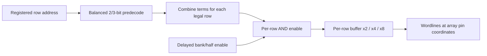

# Parameterized 8T row decoder

The decoder separates shared address predecode from local wordline phase gates
and drivers. Its physical interface follows the actual 8T array slots, including
tap gaps and the opposite half-array's pin order. The first implementation uses
ASAP7 standard cells; it establishes a functional and routed baseline for custom
driver slices in the central control/IO region.

The source is [`row_decoder.v`](../tech/verilog_dp/row_decoder.v), with the
standalone flow in
[`generate_asap7_8t_decoder.py`](../scripts/generate_asap7_8t_decoder.py).

## Architecture

Each port has an independent address path:



`sram_row_decode` produces an ungated one-hot selection. It balances groups to
avoid an unnecessary one-bit group: seven address bits become 3+2+2. Explicit
predecode cells preserve sharing through Yosys/ABC; merely retaining named
intermediate wires allowed ABC to reconstruct flat address comparators.

| Rows | Address bits | Groups with `PREDECODE_BITS=3` |
| --- | --- | --- |
| 18 or 32 | 5 | 3+2 |
| 64 | 6 | 3+3 |
| 128 | 7 | 3+2+2 |
| 256 | 8 | 3+3+2 |

`sram_wordline_driver_array` provides one explicit `AND2x2` enable gate followed
by a `BUFx2`, `BUFx4`, or `BUFx8` for every wordline. Synthesis and placement
preserve these stages. The standalone `sram_decoder_2rw` contains two decoders
and two driver arrays and serves **one half-array**.

The existing 2RW controller now shares one row decoder per port across its
banks and halves. Each bank has four separately enabled driver arrays:
top/bottom for A/B. Its default is three-bit predecode groups and x4 drivers;
the standalone generator exposes the other choices. The controller's registered
address mapping and read/write phase logic are retained. The standalone GDS is
not yet instantiated as a separate hard macro in the central floorplan.

## Parameter and timing contract

| Generator option | Meaning / default |
| --- | --- |
| `--word-lines` | Positive row count per half-array; default 32 |
| `--tap-pitch` | Rows between tap slots; 0 disables taps; otherwise must divide the row count |
| `--predecode-bits` | Maximum group width, 2 or 3; default 3 |
| `--drive` | Final buffer strength, 2, 4, or 8; default 4 |
| `--wl-load-ff` | External load on each output; default 4 fF |
| `--delay-ns` | Maximum input-to-wordline delay target; default 0.25 ns |
| `--utilization` | Initial area sizing target; default 0.60, allowed (0, 0.80] |
| `--mirror-x` | Generate output locations for the opposite half-array |

The RTL accepts non-power-of-two row counts: every unused binary address
produces all-zero wordlines. A one-row decoder retains a one-bit address bus;
only address zero selects that row. This standalone capability does not change
the full compiler's existing supported geometry restrictions.

Addresses must settle through predecode **before EN rises** and remain stable
until EN falls. EN=0 forces every wordline low. This combinational decoder is
not safe for arbitrary address changes while enabled. The controller supplies
registered addresses and delayed wordline phases; their delay margin still
needs validation with the chosen array load and PVT corners. Port A and B can
select independently; same-address collision restrictions remain the macro's
existing 2RW contract.

The load is an input to sizing/STA, not an extracted array measurement. Select
it from the intended wordline length and parasitics. The routed flow rejects
negative maximum-delay slack and reported slew/capacitance violations, in
addition to routing DRC failures. Reports use Liberty and global-route RC
estimates; they do not establish extracted timing or transistor-level signoff.

## Physical interface and generation

Output pins sit on the top boundary: WLA on M3 and WLB on M5. Their x positions
come from the canonical bitcell labels and `slot_layout`, including alternating
cell orientation and tap slots. M5 candidate tracks cover both phases required
after tap gaps. `--mirror-x` regenerates placement and routing at the reflected
pin coordinates; it does not reflect a finished layout's select/well geometry.

The die width matches the array slot span for ordinary sizes. Tiny test cases
use a minimum width of 1.296 um to fit standard cells, taps, and address pins;
their output coordinates still match the array. Height comes from mapped cell
area and utilization, rounded to standard-cell rows. There are tap/filler cells
and a connected M1/M2/M3 power network. Output pin alignment is guaranteed by
checks; the internal final drivers currently use general standard-cell placement.

```bash
.venv/bin/python scripts/generate_asap7_8t_decoder.py \
  --word-lines 32 --tap-pitch 16 --drive 4 --wl-load-ff 4 \
  --route --work tmp/decoder_x32

.venv/bin/python scripts/generate_asap7_8t_decoder.py \
  --word-lines 18 --tap-pitch 6 --mirror-x \
  --route --work tmp/decoder_x18_mirror
```

Without `--route`, generation emits the mapped Verilog/JSON, self-contained CDL
SPICE, pin plan, and routing script. With it, generation also emits routed
Verilog/SPICE, DEF, ODB, GDS with boundary/pin conductors, and timing/DRC reports.
`decoder.plan.json` records geometry, exact pin locations, estimated timing, and
verification status. Reuse the same tap pitch and mirror convention as the array.

The physical check traces every mapped cell pin and external port through the
streamed metal/via geometry, checks all supplies including filler/tap pins, and
rejects opens, shorts, shifted wordlines, and disconnected pin stubs. This is
interconnect connectivity checking, not device extraction or signoff LVS.

Measured generation results with x4 drivers and a 4 fF load:

| Rows / taps | Orientation | Size (um) | WL pins | Connected nets | Worst estimated delay (ps) |
| --- | --- | --- | --- | --- | --- |
| 1 / none | Normal | 1.296 x 1.890 | 2 | 17 | 71.7 |
| 2 / none | Normal | 1.296 x 2.430 | 4 | 21 | 70.9 |
| 18 / 6 | Opposite half | 2.268 x 10.260 | 36 | 157 | 120.9 |
| 32 / 16 | Normal | 3.672 x 10.260 | 64 | 241 | 128.6 |

All four have zero reported routing DRC or slew/capacitance violations. For the
32-row case, the separate EN-to-wordline report gives 57.9 ps. These are baseline
results from the local OpenROAD/Liberty flow, not characterized macro specs.

## Checks and next physical design step

```bash
bash tests/run_8t_decoder_check.sh
bash tests/run_8t_decoder_physical_check.sh
bash tests/run_decode_dp_check.sh
```

The first checks RTL behavior through 256 rows, mapped behavior through 128
rows, unused address codes, independent enables, retained predecode/driver
stages, and pin alignment against real array rows. The second routes the four
configurations above. Both are registered in CTest. The existing small 2RW
macro integration check also passes with the shared decoder in its controller.

For the compact central layout, replace general placement of the final gates
and drivers with characterized slices covering a fixed number of 8T slots.
Keep this predecode/interface contract, add legal tap and edge variants, and
co-design the slices' height with the IO/control rows. Compare total area,
enable skew, wordline slew, and extracted delay before choosing a denser template.
